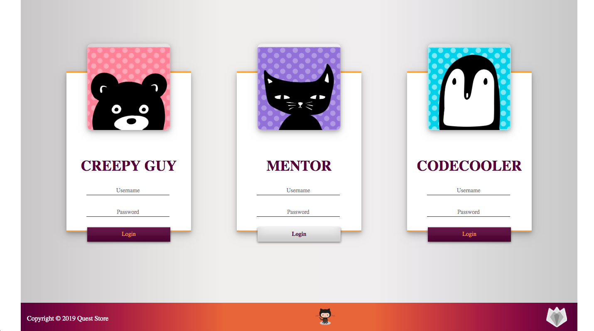

# Quest Store TML Production

####__Dear Codecoolers__,
The Creepy Guy, a Supreme Necromancer of Codecool Kingdom, has a trouble with economic management of his kingdom.
Incredible expansion of Codecool caused that's really hard to keep distribution national currency (Coolcoins) in analogy system,
based on cash contribution, so he hasn't enough time to creep his mentors... He choose and invoke.
You - the best programmers in the Universe of Code - to implement application, which will help him and mentors with coolcoins managment.

